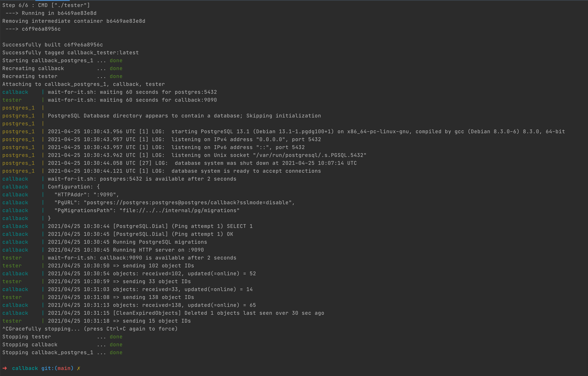

# Callback service

## Task description

### REST Service for Handling Callbacks

This repository contains a REST service designed to handle POST requests on `localhost:9090/callback`. The service is structured to interact with a Go service that dispatches requests at a fixed interval of 5 seconds. Each request contains a varying number of object IDs (up to 200), formatted as follows:

```json
{
    "object_ids": [1,2,3,4,5,6]
}
```

#### Service Operations

Upon receiving a callback, the service must:

1. Fetch details for each `object_id` from another local service accessible at `localhost:9010/objects/:id`. The response from this service may look like:
   ```
   {
      "id": <id>,
      "online": true|false
   }
   ```
   Note: Response times for this service can vary unpredictably between 300ms and 4s.

2. Filter the received objects based on their "online" status.

3. Persist the online objects in a PostgreSQL database, recording each object with a timestamp of when it was last seen.

4. Implement a mechanism to delete objects from the database if they haven't been received in more than 30 seconds, ensuring data relevance and compliance with business rules.

#### Performance and Reliability Requirements

- **High Throughput:** The service is optimized for high throughput, ensuring it can handle substantial loads effectively, suitable for a production environment.
- **Error Handling:** Robust error handling is implemented to recover from any failures, ensuring the service endpoint remains available without interruption.
- **Consistency:** Due to critical business constraints, the service guarantees that no callbacks are missed, maintaining consistent and reliable operation.

This service is crucial for maintaining up-to-date object status information and ensuring operational continuity by meeting specified business needs.

## Solution notes

- clean architecture (handler->service->repository)
- standard Go project layout (well, more or less :blush:)
- github CI/CD + docker compose + Makefile included
- PostgreSQL migrations included
- tests with mocks included
- rate limiter for object details requests included

## HOWTO

- run with `make run`
- test with `go test -v ./...` (github scrutinizer doesn't like `make test` for some reason)



